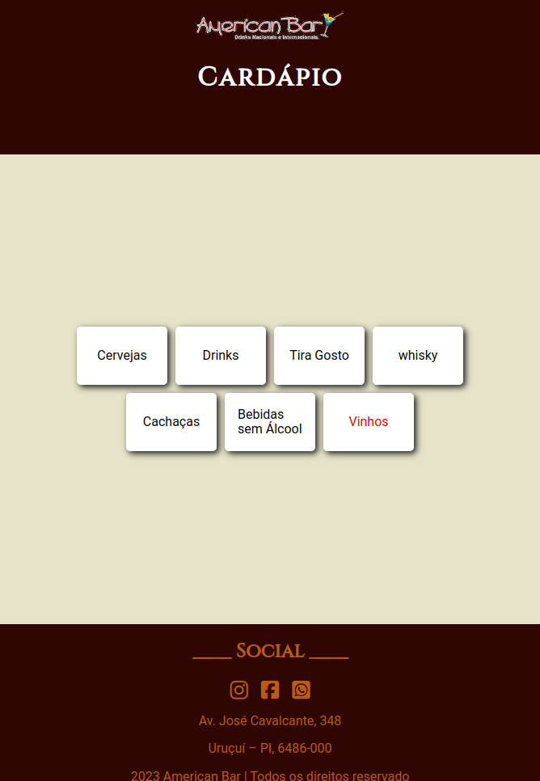

# American

Este projeto foi desenvolvido para um cliente que necessitava de um cardápio digital moderno e interativo. Utilizando HTML e CSS, criamos um cardápio digital que oferece uma experiência visualmente atraente e fácil de usar. 

### :arrow_forward: Rodando o projeto

1. Faça o clone desse repositório.
2. Abra o `index.html`

### :atom_symbol: Tecnologias 
* [HTML](https://axios-http.com/ptbr/docs/intro)
* [CSS](https://reactrouter.com/en/main)

### :desktop_computer: Previa do Projeto

